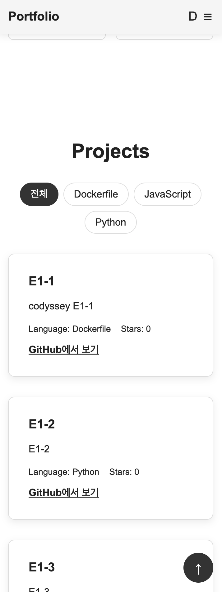

# Personal Portfolio Website

순수 HTML, CSS, JavaScript를 사용하여 제작한 반응형 개인 포트폴리오 웹사이트입니다.

외부 프론트엔드 프레임워크 없이 Semantic HTML, Responsive Web Design, DOM 조작, 이벤트 처리, GitHub API, Formspree 등을 활용하여 직접 구현했습니다.

---

## 배포 주소

* GitHub Repository: https://github.com/nothingOld/B1-1
* GitHub Pages: https://nothingold.github.io/B1-1/

---

## 주요 기능

### 1. 반응형 웹 디자인

Mobile First 방식으로 구현했으며 화면 크기에 따라 레이아웃이 자연스럽게 변경됩니다.

* Mobile: 기본 스타일
* Tablet: `768px` 이상
* Desktop: `1024px` 이상
* Flexbox 기반 Navigation
* CSS Grid 기반 Projects
* `auto-fit`, `minmax()`를 활용한 프로젝트 카드 자동 배치

---

### 2. Semantic HTML

웹 문서의 구조와 의미를 명확하게 표현하기 위해 Semantic Tag를 사용했습니다.

주요 태그:

```html
<header>
<nav>
<main>
<section>
<article>
<footer>
```

또한 접근성을 고려하여 다음 사항을 적용했습니다.

* 이미지에 의미 있는 `alt` 속성 적용
* Form의 `label`과 입력 요소의 `id` 연결
* 버튼에 `aria-label` 적용
* 햄버거 메뉴에 `aria-expanded` 적용
* 프로젝트 필터 버튼에 `aria-pressed` 적용
* 상태 메시지 영역에 `aria-live` 적용

---

## 페이지 구성

### Hero

포트폴리오의 첫 화면입니다.

* 소개 문구
* 주요 이동 버튼
* JavaScript 기반 타이핑 효과
* 반응형 Typography

타이핑 효과는 HTML에 작성된 기존 소개 문구를 JavaScript에서 읽어 한 글자씩 출력하도록 구현했습니다.

사용자가 운영체제에서 Reduce Motion을 설정한 경우 타이핑 애니메이션을 실행하지 않습니다.

---

### About

프로필 이미지와 자기소개 내용을 표시합니다.

모바일에서는 세로 방향으로 배치되고, 태블릿 이상의 화면에서는 이미지와 설명이 가로 방향으로 배치됩니다.

---

### Skills

보유 기술을 CSS Grid 형태로 표현합니다.

화면 크기에 따라 Grid Column 수가 변경되며 카드에 Hover 효과를 적용했습니다.

---

### Projects

GitHub REST API를 사용하여 Repository 정보를 동적으로 가져와 화면에 표시합니다.

사용 API:

```text
https://api.github.com/users/{username}/repos
```

현재 프로젝트에서는 GitHub Repository API의 `language` 필드를 기준으로 각 Repository의 **대표 언어**를 사용합니다.

### GitHub API 상태 처리

다음 상태를 각각 처리했습니다.

* Loading
* Success
* Empty
* Error
* Retry
* HTTP 403 Rate Limit

예:

```text
API 요청
↓
Loading

성공
├─ Repository 존재
│  └─ Project Card 렌더링
│
└─ Repository 없음
   └─ Empty 상태

실패
└─ Error 상태
   └─ 다시 시도 버튼
```

GitHub API 비인증 요청에서 HTTP `403`이 발생하는 경우 요청 제한 관련 메시지를 별도로 표시합니다.

---

## GitHub 프로젝트 카드

Repository 데이터는 JavaScript에서 동적으로 DOM 요소로 생성합니다.

주요 표시 정보:

* Repository 이름
* 설명
* 대표 언어
* Star 수
* GitHub Repository 링크

외부 API 데이터를 직접 `innerHTML`에 삽입하지 않고 다음 DOM API를 사용했습니다.

```javascript
document.createElement()
textContent
append()
```

이를 통해 외부 문자열이 HTML로 직접 해석되지 않도록 구현했습니다.

---

## 프로젝트 언어 필터

GitHub API에서 받아온 Repository의 대표 언어를 기준으로 필터 버튼을 **동적으로 생성**합니다.

예:

```text
[전체] [HTML] [JavaScript] [Python]
```

필터에 표시되는 언어를 HTML에 미리 하드코딩하지 않고 실제 Repository 데이터에서 추출합니다.

처리 흐름:

```text
GitHub Repository 목록
↓
language 값 추출
↓
null 제거
↓
Set을 이용한 중복 제거
↓
언어 필터 버튼 동적 생성
↓
filter()
↓
선택한 대표 언어의 Repository만 렌더링
```

필터 버튼 클릭 시 GitHub API를 다시 호출하지 않고 최초에 받아온 Repository 데이터를 재사용합니다.

---

## Navigation

### 햄버거 메뉴

모바일 환경에서는 Navigation 메뉴를 숨기고 햄버거 버튼을 표시합니다.

JavaScript의:

```javascript
classList.toggle('active')
```

를 이용하여 메뉴를 열고 닫습니다.

메뉴 항목을 선택하면 모바일 메뉴가 자동으로 닫힙니다.

---

### Smooth Scroll

Navigation 메뉴를 클릭하면 해당 Section으로 부드럽게 이동합니다.

```javascript
scrollIntoView({
    behavior: 'smooth'
});
```

를 사용했습니다.

---

### Scroll Header

페이지를 일정 거리 이상 스크롤하면 Header의 배경과 그림자가 변경됩니다.

기준값:

```text
60px
```

---

### Scroll To Top

페이지를 일정 거리 이상 스크롤하면 화면 우측 하단에 Scroll Top 버튼이 나타납니다.

기준값:

```text
300px
```

클릭 시 페이지 최상단으로 부드럽게 이동합니다.

---

## Dark Mode

Light Mode와 Dark Mode를 지원합니다.

CSS Variable을 사용하여 색상을 관리합니다.

예:

```css
:root {
    --background-color: #ffffff;
    --text-color: #222222;
}

[data-theme="dark"] {
    --background-color: #121212;
    --text-color: #ffffff;
}
```

### 사용자 테마 저장

사용자가 직접 선택한 테마는 `localStorage`에 저장합니다.

```text
사용자 선택
↓
localStorage
↓
새로고침
↓
기존 테마 유지
```

---

### 시스템 테마 자동 감지

사용자가 사이트에서 테마를 직접 선택한 기록이 없다면 운영체제의 테마 설정을 확인합니다.

```javascript
window.matchMedia(
    '(prefers-color-scheme: dark)'
);
```

테마 적용 우선순위:

```text
1. localStorage에 저장된 사용자 선택
2. 운영체제 Light / Dark 설정
3. 기본 Light Mode
```

사용자 선택이 없는 경우 운영체제의 테마가 변경되면 사이트에도 실시간으로 반영됩니다.

사용자가 사이트에서 직접 테마를 선택한 이후에는 시스템 설정보다 사용자 선택을 우선합니다.

---

## Scroll Animation

`IntersectionObserver`를 사용하여 Section이 Viewport에 들어오면 자연스럽게 나타나는 애니메이션을 구현했습니다.

Observer 기준값:

```javascript
threshold: 0.2
```

한 번 표시된 요소는 다시 Observer가 동작하지 않도록 `unobserve()`를 사용했습니다.

또한:

```css
@media (prefers-reduced-motion: reduce)
```

를 적용하여 사용자의 모션 감소 설정을 고려했습니다.

---

## Contact Form

Contact Form은 다음 입력값을 받습니다.

* 이름
* 이메일
* 메시지

### Validation

JavaScript를 사용하여 직접 유효성 검사를 구현했습니다.

검증 항목:

* 이름 필수 입력
* 이메일 필수 입력
* 이메일 형식 검사
* 메시지 필수 입력
* 입력값 주변에 오류 메시지 표시
* 오류 발생 후 입력 시 실시간 재검증

Form에는 `novalidate`를 적용하여 브라우저 기본 Validation 대신 직접 구현한 Validation 로직을 사용합니다.

---

## Contact Form 실제 전송

Formspree를 사용하여 실제 메시지 전송 기능을 구현했습니다.

처리 흐름:

```text
Submit
↓
preventDefault()
↓
Validation
↓
검증 실패
└─ API 호출하지 않음

검증 성공
↓
FormData 생성
↓
Formspree POST 요청
↓
전송 중 버튼 비활성화
↓
성공 / 실패 처리
```

전송 중에는 중복 제출을 방지하기 위해 Submit 버튼을 비활성화합니다.

```javascript
submitButton.disabled = true;
```

### 전송 성공

* 성공 메시지 표시
* 입력 Form 초기화
* Submit 버튼 복구

### 전송 실패

* 실패 메시지 표시
* 사용자가 작성한 입력값 유지
* Submit 버튼 복구

Form은 **실제 전송에 성공했을 때만 초기화**되도록 구현했습니다.

---

## Formspree 보안 설정

Formspree의 Form ID는 프론트엔드에서 사용하는 공개 Endpoint 식별자이므로 JavaScript에서 사용합니다.

다만 외부에서 Form Endpoint를 악용하여 Submission을 발생시키는 것을 줄이기 위해 GitHub Pages 배포 후 Formspree의 **Restrict to Domain** 기능을 설정합니다.

허용 도메인 예:

```text
nothingold.github.io
```

API Key, Secret, Token과 같은 인증 정보는 Repository에 저장하지 않습니다.

---

## JavaScript 구현 방식

외부 JavaScript Framework 또는 Library 없이 Vanilla JavaScript로 구현했습니다.

주요 사용 기능:

```text
querySelector()
querySelectorAll()

addEventListener()

classList.add()
classList.remove()
classList.toggle()

createElement()
textContent
append()

fetch()
async / await
try / catch

localStorage
matchMedia()
IntersectionObserver

map()
filter()
forEach()

FormData
setTimeout()
```

`var`는 사용하지 않고 `const`, `let`을 사용했습니다.

HTML의 Inline Event:

```html
onclick=""
```

방식은 사용하지 않고 모든 Event를 `addEventListener()`로 등록했습니다.

---

## 상태 기반 UI 처리

주요 화면 상태는 `main.js`의 단일 `STATE` 객체에서 관리합니다.
Repository 데이터, 선택된 언어, 현재 Theme을 개별 전역 변수로 분산하지 않고 하나의 상태 객체에 모아 UI 상태의 출처를 명확히 했습니다.

```javascript
const STATE = {
    repositories: [],
    selectedLanguage: 'all',
    theme: 'light'
};
```

사용자 이벤트 또는 API 응답으로 `STATE`가 변경되면 해당 상태를 기준으로 화면을 다시 렌더링합니다.

```text
Event / API Response
↓
STATE 변경
↓
Render 함수 호출
↓
DOM 업데이트
```

### GitHub Projects

```text
API 요청
↓
Loading / Success / Empty / Error
↓
UI 렌더링
```

### Project Filter

```text
필터 버튼 클릭
↓
STATE.selectedLanguage 변경
↓
filter()
↓
Project 다시 렌더링
```

### Dark Mode

```text
STATE.theme 변경
↓
data-theme 변경
↓
CSS Variable 변경
↓
UI 변경
```

### Contact Form

```text
입력 / Submit
↓
Validation / Sending / Success / Error
↓
상태 메시지 변경
```

---

## 반응형 기준

Mobile First 방식으로 개발했습니다.

| 구분      | 기준                  |
| ------- | ------------------- |
| Mobile  | 기본 스타일              |
| Tablet  | `min-width: 768px`  |
| Desktop | `min-width: 1024px` |

Projects 영역은 별도의 고정 Column 수 대신 다음 Grid 설정을 사용합니다.

```css
grid-template-columns:
    repeat(auto-fit, minmax(250px, 1fr));
```

따라서 화면 너비에 맞춰 Project Card 수가 자동으로 조정됩니다.

---

## 주요 UI 설정값

| 기능                             | 설정값      |
| ------------------------------ | -------- |
| Scroll Top 표시                  | `300px`  |
| Header 스타일 변경                  | `60px`   |
| IntersectionObserver Threshold | `0.2`    |
| Tablet Breakpoint              | `768px`  |
| Desktop Breakpoint             | `1024px` |
| Typing Speed                   | `50ms`   |

---

## 기술 스택

### Frontend

* HTML5
* CSS3
* JavaScript ES6+

### API / Service

* GitHub REST API
* Formspree

### Deployment

* GitHub Pages

### Version Control

* Git
* GitHub

---

## 프로젝트 구조

```text
E1-1/
├── index.html
├── css/
│   └── style.css
├── js/
│   └── main.js
├── images/
│   └── image.png
├── docs/
│   └── screenshots/
│       ├── desktop-light.png
│       ├── mobile-menu.png
│       ├── projects-dark.png
│       └── contact-success.png
└── README.md
```

---

## Screenshots

### Desktop - Light Mode

데스크톱 환경에서의 Hero 및 전체 레이아웃입니다.


---

### Mobile - Navigation Menu

모바일 환경에서 햄버거 메뉴를 활성화한 화면입니다.



---

### Projects - Dark Mode

Dark Mode에서 GitHub Repository 카드와 대표 언어 필터를 표시한 화면입니다.


---

### Contact Form - Success

Formspree를 통해 Contact Form 메시지가 정상적으로 전송된 화면입니다.


---

## 테스트 항목

배포된 GitHub Pages 환경을 기준으로 다음 항목을 확인합니다.

### Navigation

* 햄버거 메뉴 열기 / 닫기
* Navigation 이동
* Smooth Scroll
* Scroll Header
* Scroll Top

### Theme

* Light Mode
* Dark Mode
* `localStorage` 유지
* 시스템 테마 자동 감지
* 사용자 선택 우선 적용

### Projects

* GitHub API Loading
* Repository 정상 렌더링
* Empty 상태
* Error 상태
* HTTP 403 처리
* Retry
* 대표 언어 기반 필터
* GitHub Repository 링크

### Contact

* 필수 입력 Validation
* 이메일 형식 검사
* 실시간 Validation
* Formspree 실제 전송
* 전송 중 중복 제출 방지
* 성공 처리
* 실패 처리

### Responsive

* Mobile
* Tablet
* Desktop

### Browser

* Console Error 확인
* CSS / JavaScript / Image 경로 확인

---

## 구현 시 고려한 사항

### GitHub API 요청 최소화

프로젝트 언어 필터를 구현하기 위해 각 Repository의 `/languages` API를 추가 호출하지 않았습니다.

최초 Repository 목록 API에서 제공하는 `language` 필드를 대표 언어로 사용합니다.

따라서 Repository가 여러 개 존재하더라도 언어 필터를 위해 Repository별 API 요청을 추가로 발생시키지 않습니다.

```text
/users/{username}/repos
↓
1회 호출
↓
Repository 목록 저장
↓
language 기준 필터링
```

이를 통해 API 요청 수와 Rate Limit 영향을 줄였습니다.

---

### 외부 데이터 DOM 처리

GitHub API에서 받은 Repository 이름, 설명 등의 외부 데이터를 HTML 문자열로 직접 삽입하지 않습니다.

```javascript
element.textContent = externalData;
```

형태로 처리하여 외부 데이터를 단순 문자열로 렌더링합니다.

---

### 중복 API 호출 방지

언어 필터 버튼을 클릭할 때 GitHub API를 다시 호출하지 않습니다.

최초 API 호출 결과를 `allRepositories`에 저장하고 해당 데이터를 `filter()`하여 사용합니다.

---

## 학습 내용

이번 프로젝트를 통해 다음 내용을 학습했습니다.

* Semantic HTML을 활용한 웹 페이지 구조 설계
* Mobile First 반응형 웹 구현
* Flexbox와 CSS Grid
* CSS Variable 기반 Theme 구성
* DOM 선택 및 동적 요소 생성
* Event Handling
* Form Validation
* 비동기 통신과 REST API
* `fetch()`, `async/await`, `try/catch`
* API 상태별 UI 설계
* JavaScript 배열 메서드 `map()`, `filter()`, `forEach()`
* `localStorage`를 이용한 상태 유지
* `IntersectionObserver`
* 시스템 Dark Mode 감지
* Formspree를 이용한 실제 Form 전송
* GitHub Pages를 이용한 정적 웹사이트 배포

---

## License

본 프로젝트는 웹 프론트엔드 학습을 목적으로 제작되었습니다.
